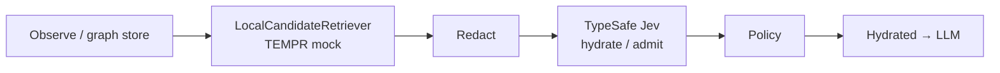

# Architecture — remember-me

**remember-me** is a decision-gate layer for agent memory: local topology store + TEMPR-style recall, then TypeSafe Jev hydrate/admit gates on redacted candidates.

## Product split



```text
┌─────────────┐     ┌──────────────────────┐     ┌─────────────┐
│  Observe /  │     │ LocalCandidateRetr.  │     │  TypeSafe   │
│  Graph store│────▶│ (TEMPR mock)         │────▶│  Jev gates  │
│  markers    │     │ keyword/tag/recency  │     │  hydrate /  │
└─────────────┘     └──────────────────────┘     │  admit      │
                                                 └──────┬──────┘
                                                        │ policy
                                                        ▼
                                                 ┌─────────────┐
                                                 │ Hydrated    │
                                                 │ nodes → LLM │
                                                 └─────────────┘
```

**Non-goals:** Jev as database; Jev as embedding/similarity ranker; auto-wiki writes from Jev confidence alone; replacing Mem0 / full memory banks.

## Horizons

| Horizon | TTL (default) | Notes |
|---------|---------------|-------|
| `working` | ~60 min | Session scratch; purge on expiry |
| `session` | ~2 days | `run_id`-scoped subgraph |
| `durable` | long | Invalidate, don't erase on TTL |

## Marker schema (v1)

`node_id`, `horizon`, `kind` ∈ {fact, episode, procedure, artifact, edge}, `content_ref`, `salience`, `ttl_expires_at`, `provenance`, optional `valid_at` / `invalid_at`, `tags`, `degree`, `last_touch`.

Bodies live at `content` / `content_ref` and are **never** included in redacted outbound state.

## Jev question IDs

1. Choice `hydrate_action`: hydrate_full | stub_only | skip | promote_durable | other
2. Score `need_for_next_turn` 1–5
3. Noul `still_matters_for_latest_ask`
4. Optional Choice `memory_network`
5. Optional Noul `trigger_reflect`
6. Admit gate: Choice `admit` + Choice `node_kind`

Model pin: **`jev-1.13.0`**.

## Fail-closed

On timeout / HTTP 401–403 / malformed JSON / missing node response:

1. Mark `GateDecision.fail_closed = True`
2. Default action: `skip`
3. Optional: local-only stub for top-k by TEMPR score (no additional cloud egress)

## Orphan hydrations

Pipeline only hydrates `node_id`s present in the local candidate set. Decisions for unknown IDs are ignored.

## Clients

| Client | Network | Use |
|--------|---------|-----|
| `FakeJev` | None | Tests, CI, bake-off, demo |
| `HttpJev` | TypeSafe API | Optional; requires `TYPESAFE_API_KEY` |

Both redact before send and expose `last_outbound` for audit assertions.

## Package

Import: `remember_me` · CLI: `remember-me`


## Dual-gate (Phase 9.5)

Local candidates first. Jev never ranks. Jev only admits.

- Ingress hydrate: mid-band → `escalate_human` + `EscalationRecord`
- Egress: `EmitEgressGate.decide_emit` / `WritebackGate.evaluate`
- Fan-out: `FANOUT_DEFAULTS` (`fanout.py`)
- No-rerank: candidate order + `local_score` immutable through Jev (`assert_no_rerank`)

See `docs/DUAL_GATE.md` and `docs/PHASE_9_5_PLAN.md`.
