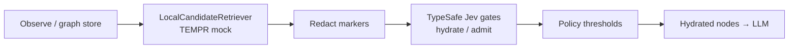

# remember-me

**Agents forget. Remember Me decides what to hydrate.**

Local recall finds candidates. TypeSafe **Jev** gates include / stub / skip / promote — *after* retrieval, on a **redacted** set. Not a memory bank. A decision gate.

[](https://www.python.org/downloads/)
[](LICENSE)
[](.github/workflows/ci.yml)
[](SCORECARD.md)

---

## Install

```bash
pip install -e ".[dev]"   # from repo root (Python 3.11+)
remember-me demo
remember-me bakeoff
```

Offline by default (`FakeJev`). Optional cloud: set `TYPESAFE_API_KEY` for `HttpJev` (pinned `jev-1.13.0`).

---

## Why not just dump context?

| Approach | What it does | What it doesn't |
|----------|--------------|-----------------|
| **Dump everything** | Shoves markers into the LLM | Budget, privacy, precision |
| **Plain TEMPR / local top-k** | Keyword / tag / recency recall | Calibrated hydrate / skip / promote |
| **Hindsight-only** | Strong memory *system* framing | A fail-closed decision gate on hydrate |
| **Mem0 / full memory banks** | Store + retrieve product surface | Separating *rank* from *admit* |
| **remember-me** | **Decision gate** after local recall | Replace your store or embedder |

Honest pitch: we sit **between** local candidates and the LLM. Jev is **not** the database and **not** the similarity ranker.

---

## Features

| Feature | Detail |
|---------|--------|
| Local topology graph | Markers + `content_ref` (bodies stay off outbound) |
| TEMPR-style recall | Keyword / tag / recency — **no Jev ranking** |
| Hydrate gate | Choice `hydrate_action` + Score need + Noul still_matters |
| Admit gate | Choice admit + closed node-kind taxonomy |
| Fail-closed policy | timeout / deny / malformed → skip (optional local stub) |
| Redaction contract | Outbound = metadata only; secrets asserted in tests |
| Offline bake-off | 50 synthetic queries → precision / overshare / latency |

---

## Architecture



```text
observe → write markers + content_ref
       → local retrieve candidates     [NO Jev ranking]
       → redact → {node_id, kind, tags, degree, last_touch, local_score, tokens_est}
       → Jev batch: hydrate_action + need + still_matters
       → policy → hydrate winners into LLM context
```

### Policy defaults (fail-closed)

| Confidence | Action |
|------------|--------|
| ≥ 0.85 | `hydrate_full` (or promote) |
| 0.55–0.85 | `stub_only` / escalate |
| < 0.55 | `skip` |
| timeout / deny / malformed | **fail-closed** → skip |

---

## Quick start

```python
from remember_me import FakeJev, MemoryPipeline, TopologyGraph, NodeKind

g = TopologyGraph()
g.observe(
    node_id="pref_theme",
    content="User prefers dark theme",
    tags=["preference", "ui"],
    salience=0.9,
)

pipe = MemoryPipeline(g, FakeJev(), top_k=5)
result = pipe.run("What is my UI theme preference?")

assert result.jev_called  # Jev is on the hydrate critical path
for node in result.hydrated:
    print(node.node_id, node.action, node.content[:60])
```

### CLI

```bash
remember-me demo
remember-me bakeoff --out bakeoff_metrics.json
remember-me score-report
```

Demo GIF placeholder: see [`assets/`](assets/README.md) (ASCII / Mermaid until a real capture lands).

---

## Package layout

```text
src/remember_me/
  types.py       # Marker schema, horizons, closed Choice taxonomies
  graph.py       # In-memory + optional SQLite topology store
  retrieve.py    # LocalCandidateRetriever (not Jev)
  redact.py      # Outbound redaction + secret assertions
  jev_client.py  # FakeJev + HttpJev
  policy.py      # Thresholds + fail-closed mapping
  gates.py       # MemoryGate, RetainAdmitGate
  pipeline.py    # observe → retrieve → redact → jev → hydrate
  bakeoff.py     # 50-query offline bake-off → metrics JSON
  cli.py
```

---

## Safety

- Outbound Jev payloads contain **only** redacted marker metadata
- Tests assert secrets / bodies never appear in outbound state
- Fail-closed on Jev errors — no theater wrappers that skip Jev on the hydrate path
- Fixtures under `fixtures/personal_prefs/` are **synthetic** (no PII)

See [SECURITY.md](SECURITY.md) and [ARCHITECTURE.md](ARCHITECTURE.md).

---

## Limitations (honest)

- **PREVIEW / Pre-Skill** — not a formal promoted skill ([SCORECARD.md](SCORECARD.md))
- Offline bake-off uses **FakeJev**; live TypeSafe pilot not claimed here
- We are a **gate layer**, not a drop-in Mem0 / full memory OS replacement
- No fake star counts, Fortune 500 logos, or “100k stars” theater

---

## Bake-off

Offline harness: **Hindsight-stub-only** (local top-k) vs **Jev-gated** hydrate on 50 labeled synthetic queries — precision@k, recall@k, overshare proxy, latency, Jev call count.

```bash
make bakeoff
```

---

## License

MIT — see [LICENSE](LICENSE).
