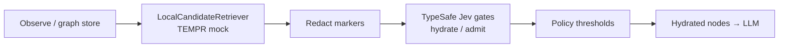

# remember-me

**Agents forget. Remember Me decides what to hydrate.**

Local recall finds candidates. TypeSafe **Jev** gates include / stub / skip / promote — *after* retrieval, on a **redacted** set. Not a memory bank. A decision gate.

### System One / intelligent if

**Decision gate, not a chat LLM.** Jev (System One) answers typed Choice / Score / Noul only — it **cannot generate prose**. remember-me uses it after local recall to decide hydrate / stub / skip. See the [Cookbook](docs/COOKBOOK.md).

[](https://www.python.org/downloads/)
[](LICENSE)
[](SCORECARD.md)

---

## Install

```bash
pip install -e ".[dev]"   # from repo root (Python 3.11+)
remember-me demo
remember-me bakeoff
```

Offline by default (`FakeJev`). `HttpJev` speaks System One (`POST /v1/systemone`, pin `jev-1.13.0`) and can **batch** multi-candidate hydrate into one POST — live mode still needs a key + pilot log; do **not** treat cloud as proven.

---

## Why not just dump context?

| Approach | What it does | What it doesn't |
|----------|--------------|-----------------|
| **Dump everything** | Shoves markers into the LLM | Budget, privacy, precision |
| **Plain TEMPR / local top-k** | Keyword / tag / recency recall | Calibrated hydrate / skip / promote |
| **Local top-k stub** (bake-off baseline) | Keyword/tag top-k stubs only | Commercial Hindsight product; calibrated live memory OS |
| **Mem0 / full memory banks** | Store + retrieve product surface | Separating *rank* from *admit* |
| **remember-me** | **Decision gate** after local recall | Replace your store or embedder |

Honest pitch: we sit **between** local candidates and the LLM. Jev is **not** the database and **not** the similarity ranker.

---

## Features

| Feature | Detail |
|---------|--------|
| Local topology graph | Markers + `content_ref` (bodies stay off outbound) |
| TEMPR-style recall | Keyword / tag / recency — **no Jev ranking** |
| Hydrate gate | Choice `hydrate_action` + Score need + Noul still_matters |
| Admit gate | Choice admit + closed node-kind taxonomy |
| Fail-closed policy | timeout / deny / malformed → skip (optional local stub) |
| Redaction contract | Outbound = metadata only; secrets asserted in tests |
| Offline bake-off | 50 synthetic queries → precision / overshare / latency |

---

## Architecture



```text
observe → write markers + content_ref
       → local retrieve candidates     [NO Jev ranking]
       → redact → {node_id, kind, tags, degree, last_touch, local_score, tokens_est}
       → Jev batch: hydrate_action + need + still_matters
       → policy → hydrate winners into LLM context
```

### Policy defaults (fail-closed)

| Confidence | Action |
|------------|--------|
| ≥ 0.85 | `hydrate_full` (or promote) |
| 0.55–0.85 | `stub_only` / escalate |
| < 0.55 | `skip` |
| timeout / deny / malformed | **fail-closed** → skip |

---

## Quick start

```python
from remember_me import FakeJev, MemoryPipeline, TopologyGraph, NodeKind

g = TopologyGraph()
g.observe(
    node_id="pref_theme",
    content="User prefers dark theme",
    tags=["preference", "ui"],
    salience=0.9,
)

pipe = MemoryPipeline(g, FakeJev(), top_k=5)
result = pipe.run("What is my UI theme preference?")

assert result.jev_called  # Jev is on the hydrate critical path
for node in result.hydrated:
    print(node.node_id, node.action, node.content[:60])
```

### CLI

```bash
remember-me demo
remember-me bakeoff --out bakeoff_metrics.json
remember-me score-report
```

Demo GIF placeholder: see [`assets/`](assets/README.md) (ASCII / Mermaid until a real capture lands).

---

## Package layout

```text
src/remember_me/
  types.py       # Marker schema, horizons, closed Choice taxonomies
  graph.py       # In-memory + optional SQLite topology store
  retrieve.py    # LocalCandidateRetriever (not Jev)
  redact.py      # Outbound redaction + secret assertions
  jev_client.py  # FakeJev + HttpJev
  policy.py      # Thresholds + fail-closed mapping
  gates.py       # MemoryGate, RetainAdmitGate
  pipeline.py    # observe → retrieve → redact → jev → hydrate
  bakeoff.py     # 50-query offline bake-off → metrics JSON
  cli.py
```

---

## Safety

- Outbound Jev payloads contain **only** redacted marker metadata
- Tests assert secrets / bodies never appear in outbound state
- Fail-closed on Jev errors — no theater wrappers that skip Jev on the hydrate path
- Fixtures under `fixtures/personal_prefs/` are **synthetic** (no PII)

See [SECURITY.md](SECURITY.md) and [ARCHITECTURE.md](ARCHITECTURE.md).

---

## Limitations (honest)

- **PREVIEW / Pre-Skill** — not a formal promoted skill. See [SCORECARD.md](SCORECARD.md) (~8.4–8.5 weighted, FakeJev evidence basis).
- **Offline bake-off ≠ live proof.** `remember-me bakeoff` uses **FakeJev** (deterministic, no network). Published `bakeoff_metrics.json` must not be read as TypeSafe cloud latency or calibrated decision quality. See [docs/HONEST_LIMITS.md](docs/HONEST_LIMITS.md) and [docs/BAKEOFF_PLAN.md](docs/BAKEOFF_PLAN.md).
- **No live acceleration claim.** We do **not** claim that Jev accelerates memory versus Hindsight or dump-all. Offline FakeJev precision deltas are **not** live proof. Any future win must be quality/token efficiency under measured live RTT — not “faster FakeJev.”
- **HttpJev contract fixed; live unproven.** Speaks public System One (`POST /v1/systemone`, `state` + typed `questions`; batched multi-candidate hydrate when possible). Do **not** advertise cloud mode as working without a successful redacted call log. See [docs/RUNTIME_HOWTO.md](docs/RUNTIME_HOWTO.md).
- **Gate layer, not a memory OS.** Non-goal: Mem0 / embedder / TEMPR-ranker replacement. Jev must not re-rank local candidates.
- **Not a drop-in Claude / Codex / Hermes skill or plugin.** Library + CLI only; no official TypeSafe skill package. See [docs/INTEGRATION_MATRIX.md](docs/INTEGRATION_MATRIX.md).
- **No theater metrics.** No fake star counts, Fortune 500 logos, or invented production case studies. **FakeJev ≠ product proof.**

---

## Bake-off

Offline harness: **`local_topk_stub`** (local top-k stubs; *not* commercial Hindsight) vs **Jev-gated** (FakeJev) on 50 labeled synthetic queries — precision@k, recall@k, overshare proxy, latency, Jev call count.

```bash
make bakeoff
```

Regenerate committed metrics with `make bakeoff` if numbers drift. See [docs/BAKEOFF_PLAN.md](docs/BAKEOFF_PLAN.md).

---

## Further docs

- [docs/COOKBOOK.md](docs/COOKBOOK.md) — Playground + System One hydrate cookbook
- [docs/MISCONCEPTIONS.md](docs/MISCONCEPTIONS.md) — common mistakes
- [docs/GETTING_STARTED_ZH.md](docs/GETTING_STARTED_ZH.md) — 繁中快速上手
- [docs/HONEST_LIMITS.md](docs/HONEST_LIMITS.md) — REAL / FAKE / CLAIMED
- [docs/RUNTIME_HOWTO.md](docs/RUNTIME_HOWTO.md) — run offline; HttpJev caveats
- [docs/INTEGRATION_MATRIX.md](docs/INTEGRATION_MATRIX.md) — Claude / Codex / Hermes positioning
- [docs/BAKEOFF_PLAN.md](docs/BAKEOFF_PLAN.md) — live bake-off plan (when ready)
- [docs/reviews/](docs/reviews/) — external review notes
- [ARCHITECTURE.md](ARCHITECTURE.md) · [SECURITY.md](SECURITY.md) · [SCORECARD.md](SCORECARD.md)

---

## License

MIT — see [LICENSE](LICENSE).
