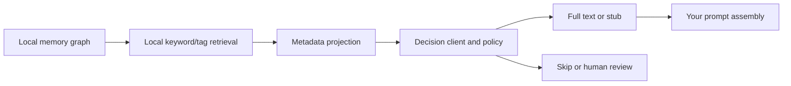

# remember-me — choose which memories enter your agent's context

**A Python memory gate that turns locally retrieved candidates into full text, short stubs, skips, or human-review decisions.**

Use it when you already have memory candidates and want an explicit, inspectable decision before loading their contents into an agent prompt. Local retrieval keeps its order; the gate decides what to include. You own the final prompt assembly.

[Quick start](#quick-start) · [Python example](#use-it-in-python) · [繁體中文](docs/GETTING_STARTED_ZH.md) · [Architecture](ARCHITECTURE.md) · [Security](SECURITY.md)

[](https://www.python.org/downloads/)
[](LICENSE)

**Status:** experimental library and CLI, version 0.1.0. The default demo runs locally with a simulated decision client (`FakeJev`), without an API key. An optional `HttpJev` client connects to TypeSafe System One. This repository does not install a Claude, Codex, or Hermes integration.

## Quick start

Install from this repository with Python 3.11+ and Git. A virtual environment is recommended.

```sh
git clone https://github.com/leonininder/remember-me.git
cd remember-me
python -m venv .venv
```

Activate the environment:

```powershell
# Windows PowerShell
.\.venv\Scripts\Activate.ps1
```

```sh
# macOS / Linux
source .venv/bin/activate
```

Then install and run:

```sh
python -m pip install -e .
python -m remember_me.cli demo
```

If PowerShell blocks activation, use `.\.venv\Scripts\python.exe` in place of `python` in the last two commands; no execution-policy change is needed. Dependency installation uses the network; the demo itself does not.

The demo asks for UI and locale preferences. An observed offline run produced:

```text
Candidates (4): pref_lang, fact_tz, pref_theme, proc_commit
Jev called: True (client.call_count=1)
pref_lang: escalate_human
fact_tz: skip
pref_theme: escalate_human
proc_commit: skip
Escalate-human count: 2; escalation records: 2
Hydrated (0)
```

This is a condensed transcript, not a quality benchmark. Zero hydrated memories is a valid outcome: the default policy leaves uncertain choices for review. `Jev called` means the simulated client ran in this demo, not a cloud request. For a controlled example that returns full text and demonstrates an outage, run:

```sh
python examples/context_gate.py
```

Expected output:

```text
Forced offline acceptance: Use dark theme
Simulated timeout: 0 memories loaded; 1 fail-closed decision
```

The first decision is forced to exercise the full-text path; it is not evidence
that a model selected the right memory. The timeout demonstrates that missing
decisions do not silently load the full memory.

## Use it in Python

For an executable local integration, try the [context host](docs/LOCAL_HOST.md):

```sh
python -m remember_me.local_host --memories examples/host_memories.json --scope alpha --query build --max-bytes 256
```

It returns actual message objects containing the Alpha build command, excludes
other-scope/private memories, and records pending-review IDs. Its policy is explicit
local scope rules, not a simulated or learned Jev decision. The memory block has a
hard UTF-8 byte cap; the query and message wrapper are outside that cap. Supply
trusted scope tags and apply your own authorization before connecting a model.
The [same-task comparison](examples/evaluate_local_host.py) reports retained,
missed, and wrongly included memories, byte use, and elapsed time on six synthetic
tasks. It measures the scope rule's behavior, not production or model quality.

```python
from remember_me import FakeJev, MemoryPipeline, TopologyGraph

graph = TopologyGraph()
pipe = MemoryPipeline(graph, FakeJev(), top_k=5)
graph.observe(
    node_id="pref_theme",
    content="Use dark theme in the editor",
    tags=["preference", "ui"],
    salience=0.9,
)
result = pipe.run("What is my UI theme preference?")
for decision in result.decisions:
    print(decision.node_id, decision.action.value, decision.reason)

# Inspect decisions first. Your application chooses whether/where to send this text.
context = "\n".join(node.content for node in result.hydrated)
```

`hydrate` means loading a selected memory's contents. `stub_only` returns a marker rather than its body. `escalate_human` returns a structured record for your application to handle; it does not contact a reviewer automatically.

## Where it fits


```mermaid
flowchart LR
  A[Local memory graph] --> B[Local keyword/tag retrieval]
  B --> C[Metadata projection]
  C --> D[Decision client and policy]
  D --> E[Full text or stub]
  D --> F[Skip or human review]
  E --> G[Your prompt assembly]
```

| Need | Current support |
|---|---|
| Inspect choices before adding memory to context | Per-candidate actions, confidence, reasons, escalation records |
| Keep retrieval separate from admission | Local keyword/tag/recency retrieval; survivors keep their original order |
| Try without credentials | Offline `FakeJev`, CLI demo, synthetic fixtures |
| Use TypeSafe System One | `HttpJev`, model pin, batched requests; [runtime guide](docs/RUNTIME_HOWTO.md) |
| Persist local markers | In-memory graph with explicit SQLite save/load methods |
| Explore output/writeback decisions | Optional dual-gate API; [contract](docs/DUAL_GATE.md) |
| Plug into an existing agent | Python integration required; [cookbook](docs/COOKBOOK.md) |

A full memory service manages storage, retrieval, integrations, and operations. This project focuses on the admission step after retrieval. Choose it to experiment with that step; retain your existing store or adapter where needed. No competitor benchmark is claimed.

## Evidence and limits

- **Reproducible offline checks:** tests exercise policy thresholds, fail-closed responses, candidate ordering, redaction, HTTP mocks, real localhost HTTP (including malformed answers and node-ID round trips), and audit records. `FakeJev` is a test double, not calibrated decision quality.
- **Historical live artifact:** the repository contains a [2026-09-22 pilot](docs/reviews/LIVE_PILOT_ENRICH_V2_2026-09-22.md) and [metrics JSON](bakeoff_metrics_live.json) for 50 synthetic queries. These report precision 0.727 versus the local stub baseline's 0.387, recall 0.95 versus 0.98, and p95 latency about 498 ms versus 0.23 ms. They are maintainer-recorded results, not independently reproduced measurements or proof of general production benefit.
- **Tradeoff:** the recorded live gate adds latency. Measure quality, recall, token use, and latency on your own task before adopting it. Synthetic overshare metrics are not a privacy guarantee.
- **Safety boundary:** memory bodies are omitted from the default gate payload, but IDs, tags, and derived metadata can still identify people or projects. Supply non-sensitive metadata. Selected full memory text is returned to the caller, who controls any later LLM disclosure. See [SECURITY.md](SECURITY.md).
- **Scope:** no shipped automatic agent integration or managed production service. Internal review history and earlier promotion gates are retained in [SCORECARD.md](SCORECARD.md); they are not user adoption evidence.

## Verify and contribute

From the repository root:

```sh
python -m pip install -e ".[dev]"
python -m pytest -q
python -m ruff check src tests examples
python -m remember_me.cli bakeoff --out bakeoff_metrics.json
```

The bake-off runs 50 synthetic queries with `FakeJev`; use it for regression checks. It does not measure cloud performance.

Useful first contributions: a reproducible integration example for one agent, a new labeled retrieval case, or a failing boundary test. [Open an issue](https://github.com/leonininder/remember-me/issues) with your Python/OS version, minimal input, expected decision, and observed decision. Use synthetic data and omit credentials. See [CONTRIBUTING.md](CONTRIBUTING.md).

## More documentation

- [Architecture](ARCHITECTURE.md) and [security contract](SECURITY.md)
- [Runtime guide](docs/RUNTIME_HOWTO.md) and [cookbook](docs/COOKBOOK.md)
- [Local host](docs/LOCAL_HOST.md) and [historical host research](docs/INTEGRATION_MATRIX.md)
- [Release candidate, launch checklist and feedback](docs/LAUNCH_CHECKLIST.md)
- [Historical evidence and limits](docs/HONEST_LIMITS.md)
- [Live evaluation plan](docs/BAKEOFF_PLAN.md)

MIT licensed. See [LICENSE](LICENSE).
